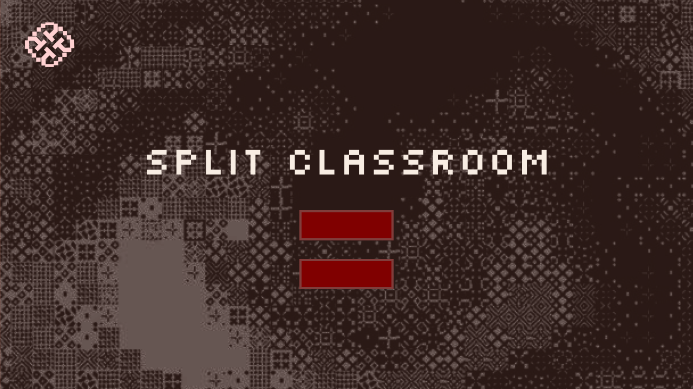

**After downloading the project, follow these steps to run the application:**

1. **Extract the downloaded files.**
2. **Open the 'src' folder.**
3. **Execute the 'main.py' file.**

# Game Introduction: Split Classroom

Welcome to "Split Classroom" — a fun little game designed based on our experiences at PolyU, addressing emotional management and academic challenges through an interactive narrative. In this game, you play as a student facing various classes, teachers, and unexpected events. With each round of choices, your emotional value (P-value) will fluctuate with the development of events. The goal is to keep your P-value below 100 and successfully manage your emotions, overcoming inner anxiety and unease.

## Game Rules:

1. Emotional Value (P-value): Your P-value represents your current emotional state. The initial value is 50, with a range of 0-100. The higher the P-value, the closer you are to an emotional breakdown. If the P-value reaches 100, your emotions are out of control, and the game ends.

2. Weekly Class Schedule: Each day brings different classes and unexpected events. You will influence the P-value by choosing different actions. Each teacher's personality, class content, and unexpected events will affect your choices and emotions.

3. Choices and Consequences: Each time you face a choice, it will lead to fluctuations in the P-value. Your task is to manage your emotions well, keep the P-value within a controllable range, and make the most appropriate choices based on the teachers' personalities.

4. Timing Mechanism: At the start of each day, time will automatically pass, and the P-value will increase with the passage of time. Every 5 minutes, the P-value increases by 5 points. Once you make a choice, the mechanism of P-value increase due to the passage of time will temporarily stop until you enter the next round of choices.

---

## Gameplay:

1. Daily Scenarios: At the start of each day, you will see a brief inner monologue or situation description, which will help you understand your current emotional state and the challenges you are about to face.

2. Class Interactions: You will face different classes and classroom situations. In each class, the teacher's feedback and your choices will affect your P-value. Make the most appropriate decisions based on the teacher's personality.

3. Unexpected Events: In addition to classes, you will encounter some unexpected events (such as coffee machine breakdowns, mentor conversations, etc.), which will also affect your emotions.

4. Choices and Feedback: Each choice will lead to fluctuations in the P-value. Depending on your choices, you will receive different feedback. Make decisions that best help you manage your emotions based on the teacher's personality and classroom situation.

5. P-value Management: The goal of the game is to keep the P-value below 100 through reasonable choices. If your P-value reaches 100, the game ends. You need to pay attention to your emotions at all times to avoid losing control.

---

## How to Win:

1. Emotional Management: Make wise choices by understanding each teacher's personality and class content, and manage your emotional fluctuations well.

2. Interaction with Teachers: Maintain good interaction with teachers and make appropriate decisions based on their personalities. Successfully manage your emotions, overcome inner unease and anxiety, and get through all the challenges of the week, and you win the game!

---

## Teacher Personality Profiles:

- Teacher Simon (Management Class, Times: 10:30-12:30 / 13:30-17:30)
  - Personality: Gentle and peaceful, focusing on emotional management and encouraging students to express their feelings. He encourages you to stay calm but will also guide you when you are too nervous.
  - Impact: If you show excessive anxiety, he will suggest you calm down. Proper rest and emotional adjustment are important for you.

- Teacher Anthony (Theory Class, Times: 9:30-11:30 / 12:30-18:30)
  - Personality: Humorous and relaxed, with a loose classroom atmosphere. He can use humor to dissolve pressure and promote discussion among students, but he has high requirements for the depth of thought.
  - Impact: He will support you when you actively participate in discussions, but if you remain silent due to anxiety, it may affect your interaction with the teacher.

- Teacher David (Business Class, Times: 13:30-17:30)
  - Personality: Strict and demanding, with a tense classroom atmosphere. He expects quick responses from students and expresses dissatisfaction with late answers.
  - Impact: He likes to challenge students, but if you cannot respond quickly to questions, it may intensify your anxiety. Successful performance may relieve your pressure, but excessive anxiety may also lead to emotional breakdown.

- Teacher Gio (Technical Class, Times: 9:30-11:30 / 12:30-18:30)
  - Personality: Rigorous and calm, focusing on practical operations in the classroom. He encourages students to solve problems independently but does not exert too much pressure, offering more guidance.
  - Impact: He focuses more on your problem-solving process rather than the outcome. If you encounter technical difficulties, he will provide constructive feedback, but if you choose to give up, you may feel lost.

- Mentor Herny (Free Discussion Class, Times: Any)
  - Personality: Concerned about student progress and enjoys in-depth communication with students. He pays attention to students' emotional states and provides advice based on the situation.
  - Impact: He will listen to your confusion and offer gentle guidance. Your emotional fluctuations will affect his feedback to you.

---

## Warm Prompt:
- You can switch languages in the top left corner and adjust the background volume in the top right corner.
- We have currently produced only a one-week demo version, mainly to collect player feedback and test the gameplay. We hope that more feedback will help us optimize and expand the game content to provide a better gaming experience. Thank you for your support!

---

## Good luck, and we hope you can get through each day smoothly!
